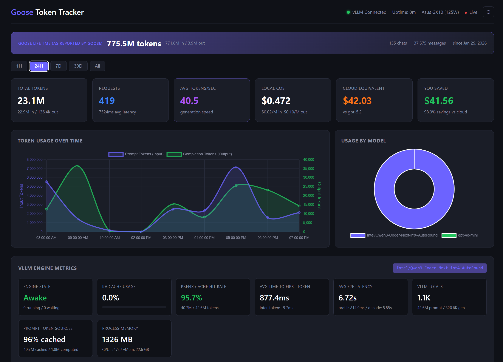
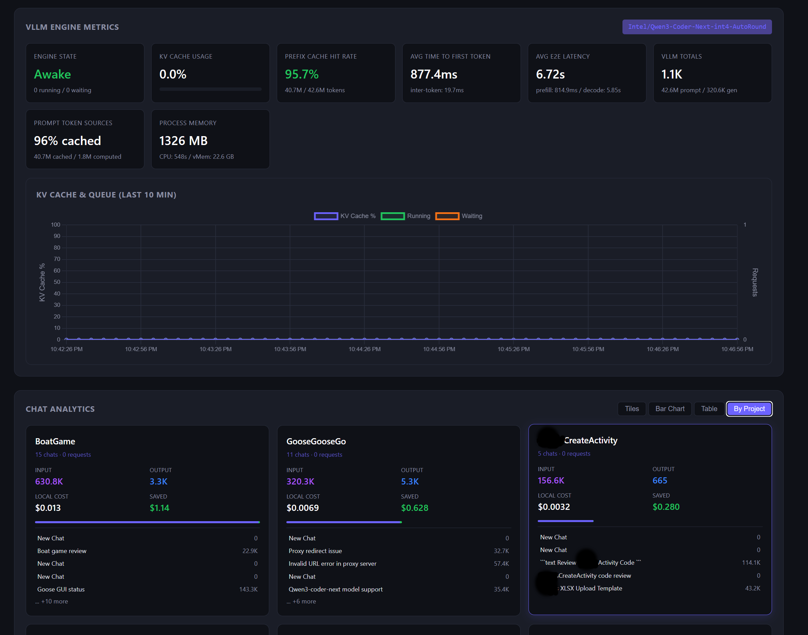
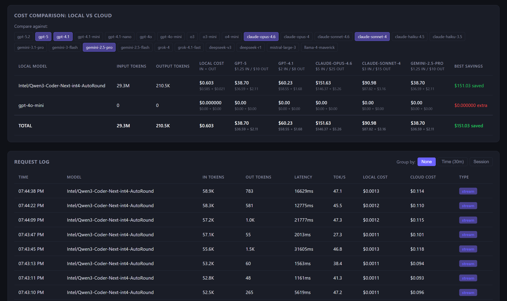
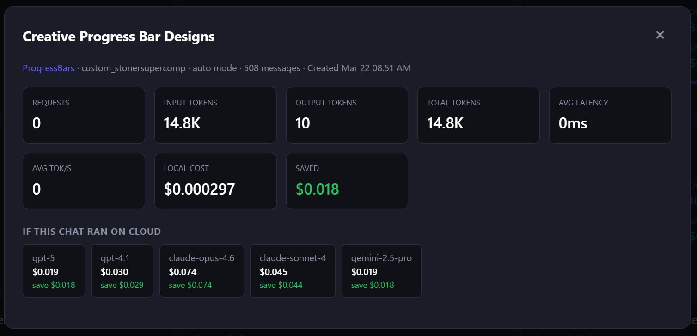
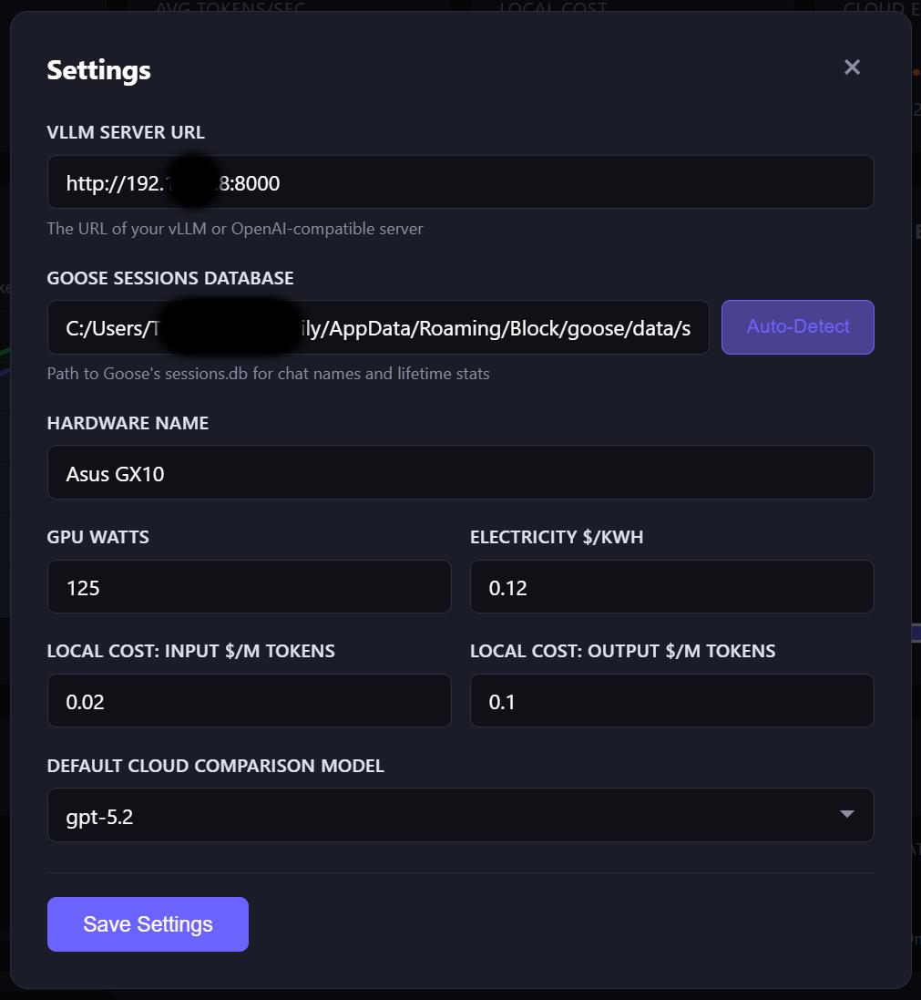
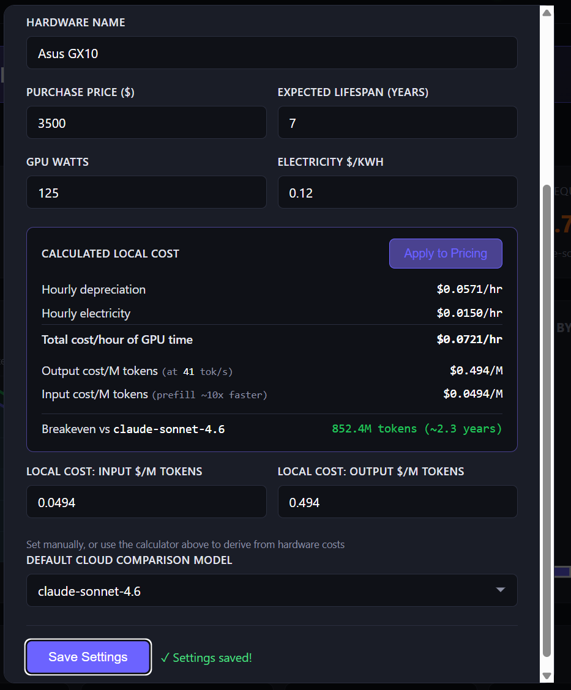

# Goose Token Tracker

A lightweight reverse-proxy that sits between [Goose](https://block.github.io/goose/) (or any OpenAI-compatible client) and a local [vLLM](https://github.com/vllm-project/vllm) server, tracking every token, calculating costs, and serving a live dashboard.

 

## Screenshots

<p align="center">
  
  <br><em>Dashboard overview with Goose lifetime stats, summary cards, usage charts, and live vLLM engine metrics</em>
</p>

<p align="center">
  
  <br><em>vLLM metrics detail and Chat Analytics grouped by project with per-chat breakdowns</em>
</p>

<p align="center">
  
  <br><em>Cost comparison with input/output breakdown, model selector, and paginated request log</em>
</p>

<p align="center">
  
  <br><em>Chat detail modal with token counts, costs, and per-model cloud comparison</em>
</p>

<p align="center">
  
  
  <br><em>Settings with hardware cost calculator, breakeven analysis, and auto-detected Goose DB</em>
</p>

## The Problem

Running local LLMs is incredibly cost-effective — but you get **zero observability**. Goose tracks some session-level totals, but that's not enough for serious usage monitoring. Here's what's missing:

| Metric | Goose Sessions DB | Token Tracker Proxy |
|--------|:-:|:-:|
| Total tokens per session | Partial (session-level only) | Per-request |
| Input vs output breakdown | Session-level only | Per-request |
| Per-message token counts | All NULL | Exact from vLLM |
| Latency per request | No | Yes (ms) |
| Tokens/second speed | No | Yes |
| Streaming support | No tracking | Full SSE tap |
| Local cost calculation | No | Per-token pricing |
| Cloud cost comparison | No | 26 models |
| vLLM engine metrics | No | KV cache, TTFT, queue, memory |
| Chat name / session grouping | Yes (names only) | Yes (merged with Goose data) |
| Request-level detail | No | Full log with pagination |
| Data persistence | Partial | Full SQLite |
| Real-time dashboard | No | Live SSE updates |

**Goose's sessions.db has the chat names and lifetime totals. The proxy has the per-request detail. Together, you get the full picture.**

## What You Get

- **Real-time token counting** for every request (input + output), read directly from vLLM's response (not estimated)
- **Cost comparison** against 26 cloud models (GPT-5.2, Claude Opus 4.6, Gemini 3.1 Pro, Grok 4, DeepSeek R1, etc.)
- **Live vLLM engine metrics** (KV cache, prefix cache hit rate, TTFT, queue depth, memory)
- **Chat Analytics** — see token usage, cost, and savings per Goose chat session with actual chat names
- **Goose Lifetime Stats** — total tokens across all sessions, as reported by Goose
- **Configurable Settings** — change vLLM URL, Goose DB path, pricing, and hardware from the dashboard
- **A clean dark-mode dashboard** with charts, grouped request logs, and model selectors
- **SQLite storage** — your data stays local and survives restarts

## Architecture

```
Goose / Any Client          Token Tracker (port 3000)           vLLM (port 8000)
     |                            |                                  |
     |--- /v1/chat/completions -->|--- forwards request ----------->|
     |                            |    logs tokens, latency          |
     |<-- streamed response ------|<-- forwards response ------------|
     |                            |    computes costs, savings       |
     |                            |                                  |
     |    http://localhost:3000   |                                  |
     |--- Dashboard UI ---------->|    (serves static dashboard)     |
                                  |--- /metrics polling ------------>|
                                       (vLLM Prometheus metrics)
                                  |--- reads Goose sessions.db ----->|
                                       (chat names, lifetime stats)
```

**Key design decisions:**
- **Reverse proxy** (not forward proxy) — only LLM API traffic hits the proxy; extensions, tools, and other traffic go direct
- **Reads vLLM's actual `usage` field** — no token estimation, exact counts every time
- **Never mutates responses** — the proxy is invisible to Goose's parser
- **Injects `stream_options`** into streaming requests so vLLM reports usage in the final chunk

## Quick Start

### Prerequisites
- Node.js 18+
- A running vLLM server (or any OpenAI-compatible API)

### Install

```bash
git clone https://github.com/MrStonerT/goose-token-tracker.git
cd goose-token-tracker
npm install
```

### Configure

On first run, `config.json` is auto-created from `config.example.json`. Edit it with your vLLM server address, or use the Settings page in the dashboard:

```bash
cp config.example.json config.json  # optional — auto-created on first run
```

```json
{
  "proxyPort": 3000,
  "targetUrl": "http://YOUR_VLLM_IP:8000"
}
```

> **Note:** `config.json` is gitignored to keep your personal settings (IP addresses, paths) out of version control.

### Run

```bash
npm start
```

Then open **http://localhost:3000** for the dashboard.

### Point Your Client at the Proxy

Instead of pointing Goose (or any client) directly at your vLLM server, point it at `http://localhost:3000`. The tracker transparently proxies all `/v1/*` requests.

**For Goose:** Change your provider's host URL from `http://YOUR_VLLM_IP:8000` to `http://localhost:3000` in Goose settings. No special environment variables needed — just change the URL.

**For other clients** (Open WebUI, Continue, LM Studio, etc.): Set the API base URL to `http://localhost:3000/v1`.

### Connect to Goose (Optional)

To see chat names and lifetime stats, point the tracker at Goose's sessions database:

1. Open Settings (gear icon in the dashboard header)
2. Click **Auto-Detect** next to "Goose Sessions Database"
3. Save — the lifetime banner and chat analytics will populate immediately

Common paths:
- **Windows:** `%APPDATA%\Block\goose\data\sessions\sessions.db`
- **macOS:** `~/Library/Application Support/Block/goose/data/sessions/sessions.db`
- **Linux:** `~/.config/goose/data/sessions/sessions.db`

## Dashboard

The dashboard at `http://localhost:3000` provides:

### Goose Lifetime Banner
- Total tokens across all Goose sessions (matches Goose's own total)
- Input/output breakdown, chat count, message count, and "since" date

### Summary Cards
- Total tokens (input/output breakdown) tracked through the proxy
- Request count with average latency
- Tokens/second generation speed
- Local cost vs cloud equivalent
- Total savings

### Token Usage Chart
- Dual Y-axis: input tokens (left) and output tokens (right) over time
- Switchable time ranges: 1H, 24H, 7D, 30D, All

### Chat Analytics
- **Tiles view** — visual cards for each chat with token counts, cost, and savings
- **Bar chart** — compare token usage across chats
- **Table view** — sortable columns with all metrics
- **Detail modal** — click any chat for full per-request breakdown
- Merges proxy-tracked data with Goose's chat names and metadata

### vLLM Engine Metrics (live from `/metrics`)
- Engine state (awake/sleeping) and request queue
- KV cache usage with color-coded progress bar
- Prefix cache hit rate
- Time to first token, inter-token latency, E2E latency
- Prefill vs decode time breakdown
- Prompt token sources (cached vs computed)
- Process memory and CPU usage
- 10-minute history chart for KV cache and queue depth

### Cost Comparison
- Side-by-side cost table: your local cost vs any combination of cloud models
- Checkbox model selector with 16 pre-configured models
- Per-model and total savings calculations

### Request Log
- Flat list with pagination
- Group by **time** (30-minute windows) or **session**
- Click to expand groups and see individual requests

### Settings
- vLLM server URL
- Goose sessions database path with auto-detect
- Hardware name, GPU watts, electricity cost
- Local cost pricing (input/output per million tokens)
- Default cloud comparison model

## Configuration

### `config.json`

| Field | Description | Default |
|-------|-------------|---------|
| `proxyPort` | Port the tracker listens on | `3000` |
| `targetUrl` | Your vLLM server URL | `http://localhost:8000` |
| `dbPath` | SQLite database path | `./data/tracker.db` |
| `gooseSessionsDb` | Path to Goose's sessions.db (optional) | |
| `hardware.name` | Your GPU name (for dashboard display) | |
| `hardware.gpuWatts` | GPU power draw in watts | `125` |
| `hardware.electricityCostPerKwh` | Your electricity rate | `0.12` |
| `localModelPricing.default` | Flat per-token local cost | `$0.02/M in, $0.10/M out` |
| `cloudComparisonModels` | Cloud models for cost comparison | 26 models included |
| `defaultCompareModel` | Default model for savings calculation | `gpt-5.2` |
| `dashboardCompareModels` | Models shown by default in cost table | 5 models |

All settings can also be changed from the dashboard's Settings page.

### Cloud Models Included (26 models, March 2026 pricing)

| Model | Input $/M | Output $/M |
|-------|-----------|------------|
| GPT-5.2 | $1.75 | $14.00 |
| GPT-5 | $1.25 | $10.00 |
| GPT-4.1 | $2.00 | $8.00 |
| GPT-4.1 Mini | $0.40 | $1.60 |
| GPT-4.1 Nano | $0.10 | $0.40 |
| GPT-4o | $2.50 | $10.00 |
| GPT-4o Mini | $0.15 | $0.60 |
| o3 | $2.00 | $8.00 |
| o3 Mini | $1.10 | $4.40 |
| o4 Mini | $1.10 | $4.40 |
| Claude Opus 4.6 | $5.00 | $25.00 |
| Claude Opus 4 | $15.00 | $75.00 |
| Claude Sonnet 4.6 | $3.00 | $15.00 |
| Claude Sonnet 4 | $3.00 | $15.00 |
| Claude Haiku 4.5 | $1.00 | $5.00 |
| Claude Haiku 3.5 | $0.80 | $4.00 |
| Gemini 3.1 Pro | $2.00 | $12.00 |
| Gemini 3 Flash | $0.50 | $3.00 |
| Gemini 2.5 Pro | $1.25 | $10.00 |
| Gemini 2.5 Flash | $0.30 | $2.50 |
| Grok 4 | $3.00 | $15.00 |
| Grok 4.1 Fast | $0.20 | $0.50 |
| DeepSeek V3 | $0.28 | $0.42 |
| DeepSeek R1 | $0.55 | $2.19 |
| Mistral Large 3 | $0.50 | $1.50 |
| Llama 4 Maverick | $0.15 | $0.60 |

## Windows Auto-Start

To start the tracker automatically on boot:

1. Place a shortcut to `start-background.vbs` in your Windows Startup folder:
   ```
   %APPDATA%\Microsoft\Windows\Start Menu\Programs\Startup\
   ```
2. The tracker runs silently in the background with logs at `data/server.log`

Batch files included:
- `start.bat` — Run with visible console window
- `start-background.bat` — Run minimized
- `start-background.vbs` — Run fully silent (for auto-start)

## API Endpoints

| Endpoint | Description |
|----------|-------------|
| `GET /api/stats?since=1h\|24h\|7d\|30d\|all` | Summary statistics |
| `GET /api/stats/models` | Per-model breakdown |
| `GET /api/stats/sessions` | Per-session stats |
| `GET /api/requests?limit=50&offset=0` | Paginated request log |
| `GET /api/requests/grouped?by=time\|session` | Grouped request log |
| `GET /api/cost-comparison` | Cost comparison with all cloud models |
| `GET /api/cloud-models` | Available cloud models and pricing |
| `GET /api/chats` | Chat analytics with Goose session names |
| `GET /api/chats/:sessionId` | Detailed per-chat stats |
| `GET /api/goose/lifetime` | Lifetime stats from Goose's sessions.db |
| `GET /api/goose/status` | Goose DB connection check |
| `GET /api/settings` | Current settings |
| `POST /api/settings` | Update settings |
| `POST /api/settings/detect-goose` | Auto-detect Goose installation |
| `GET /api/vllm-metrics` | Latest vLLM engine metrics |
| `GET /api/vllm-metrics/history` | vLLM metrics time series |
| `GET /api/trends/hourly` | Hourly token trends |
| `GET /api/trends/daily` | Daily token trends |
| `GET /api/health` | Health check (proxy + vLLM status) |
| `GET /api/live` | SSE stream for real-time updates |

## Tech Stack

- **Node.js + Express** — reverse proxy and API server
- **better-sqlite3** — local token/cost storage + reads Goose's sessions.db
- **Chart.js** — dashboard charts (CDN, no build step)
- **Vanilla JS/CSS** — zero frontend build step, zero frontend dependencies

## How Local Cost is Calculated

By default, local cost uses **flat per-token pricing** (configurable in settings):
- Input: $0.02 per million tokens
- Output: $0.10 per million tokens

This accounts for hardware amortization, not just electricity. Pure electricity cost is also computed (GPU watts x time x $/kWh) but it's vanishingly small for local inference (~$0.000004/request).

## How Goose Token Numbers Work

Goose's sessions.db stores two sets of token numbers:

- **`total_tokens`** — unique/new tokens per session (what you'd count if deduplicating)
- **`accumulated_total_tokens`** — running total including conversation context re-sent with every request

The **accumulated** number is what Goose shows in its UI (e.g., "773M tokens") and what the lifetime banner displays. This number grows fast because every message in a conversation includes the full prior context.

## Contributing

PRs welcome! Some ideas:
- [ ] CSV/JSON data export
- [ ] Token budget alerts
- [ ] Multi-server load balancing
- [ ] Grafana/Prometheus export endpoint
- [ ] Model A/B performance comparison
- [ ] Goose MCP extension for in-chat stats
- [ ] Docker container

## License

MIT
